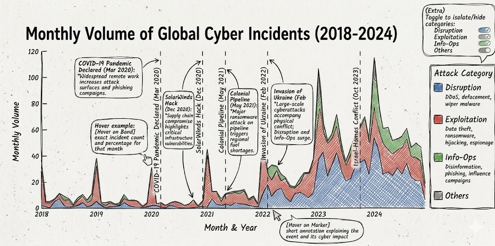
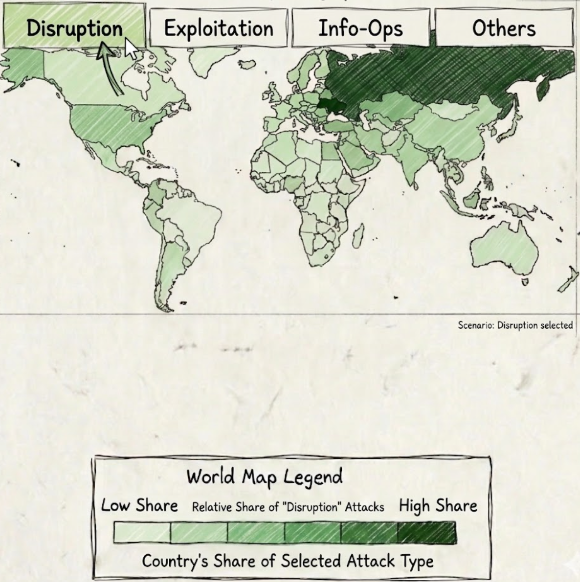

# **CyberAnalysts** - Milestone 2

## Project Goal

There is an ever-going arms race between countries, companies, and individuals over data — be it bank records, military positions, or political influence. Our project retraces the history of cyber conflict and links it to the geopolitical events that shaped it, making two decades of cyber warfare readable to anyone without a technical background.

Our project helps users understand:

- **Where attacks happen globally** — which countries are the most targeted and what types of attacks they face
- **How attack types evolve over time** — tracking shifts in the nature of cyberattacks across the years, and how major geopolitical events correlate with those shifts
- **Whether Switzerland is as exposed as other nations** — evaluating if Switzerland faces the same level and severity of attacks as the most targeted countries in the world

## Visualizations

### 1) Most Frequent Attack Types Over Time — Streamgraph

#### Description & sketch

A streamgraph showing the **monthly volume of global cyber incidents from 2018 to 2024**, stacked by attack category:
- **Disruption** — DDoS, defacement, wiper malware
- **Exploitation** — data theft, ransomware, hijacking, espionage
- **Info-Ops** — disinformation, phishing, influence campaigns
- **Others**

We chose a streamgraph over a simple line chart because it simultaneously conveys the **total volume explosion** over time and the **shift in attack composition** — for example, the Disruption band visibly doubles after February 2022. A line chart would require the reader to mentally reconstruct both dimensions.

Vertical dashed markers annotate key geopolitical events directly on the time axis, directly addressing the professor's feedback on showing the influence of political context on cyberattacks:
- COVID-19 Pandemic (Mar 2020)
- SolarWinds Breach (Dec 2020)
- Colonial Pipeline Attack (May 2021)
- Russia's Invasion of Ukraine (Feb 2022)
- Israel-Hamas Conflict (Oct 2023)

**Interactions:**
- Hover on each band → exact incident count and percentage for that month
- Hover on event markers → short annotation explaining the event and its cyber impact
- *(Extra)* Toggle to isolate/hide individual attack categories

#### Tools & lectures needed

**Tools:**
- D3.js
- Plotly.js

**Lectures:**
- 4_2_D3
- 5_1_Interaction
- 6_1_Perception_colors
- 6_2_Mark_channel
- 11_1_Tabular_data

### 2) World Map of Attack Intensity by Country & by Attack Type (selectable) — Choropleth Map

#### Description & sketch

A choropleth world map where each country is colored by its **share of global cyber attacks**, with darker shades indicating a higher percentage. The default view shows overall attack intensity across all types.

On the side, a **dropdown menu** lets the user filter by attack category:
- All (default)
- Disruption
- Exploitation
- Info-Ops
- Others

Selecting a category updates the map to show each country's share of that specific attack type, for example, switching to "Disruption" would highlight Ukraine and Russia more heavily, while "Info-Ops" would shift focus toward the United States. The color scale is always normalized to the currently selected filter so relative differences remain visible.

**Interactions:**
- Dropdown menu to switch between attack type views
- Hover on a country → tooltip showing country name, percentage of selected attack type, and raw incident count
- *(Extra)* Click on a country to pin a detail panel showing its full attack type breakdown

#### Tools & lectures needed

**Tools:**
- D3.js
- TopoJSON
- Leaflet (maybe)

**Lectures:**
- 4_2_D3
- 5_1_Interaction
- 6_1_Perception_colors
- 6_2_Mark_channel
- 8_1_Maps
- 8_2_Practical_maps

### 3) Deep Dive into Cybercrime in Switzerland — Network Graph + Age Susceptibility Plot

#### Description & sketch

After establishing the global context in visualizations 1 and 2, this final section narrows the focus to Switzerland and explores cybercrime inside the country in more detail. Rather than comparing Switzerland to other countries, this part turns the dataset into a domestic deep dive that shows which cybercrime categories dominate, how they break down into smaller subsets, and which age groups are most vulnerable.

Two plots structure this section, presented one after the other:

**1) Cybercrime structure in Switzerland (network graph):**
A node-link graph starts from the root node, representing total cybercrime in Switzerland, then branches into main subcategories such as malware, cyber fraud, phishing, and other relevant groups. The graph continues outward into smaller subsets, for example cyber fraud splitting into romance scam and malware splitting into trojan. Because the structure is acyclic and expands outward from the root, a network graph is a natural way to show both the hierarchy and the decomposition of crime types. Each category is represented by a circle who's size is proportional to its incident count.

**2) Age susceptibility to cybercrime (simple plot):**
A simple plot shows how different age ranges are affected by cybercrime in Switzerland. The goal is to make the relative susceptibility of each age group easy to read at a glance, so the chart emphasizes which ranges are most exposed and whether vulnerability rises or falls with age.

**Interactions:**
- Hover on a node or edge → exact category name, share, and incident count
- Hover on an age range → susceptibility value and raw incident count
- Click a node to highlight its descendants and trace the full path from the root

#### Tools & lectures needed

**Tools:**
- D3.js
- Plotly.js

**Lectures:**
- 4_2_D3
- 5_1_Interaction
- 6_1_Perception_colors
- 6_2_Mark_channel
- 11_1_Tabular_data

### Website development

## Additional ideas