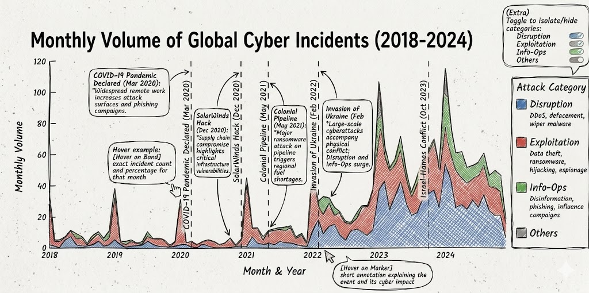
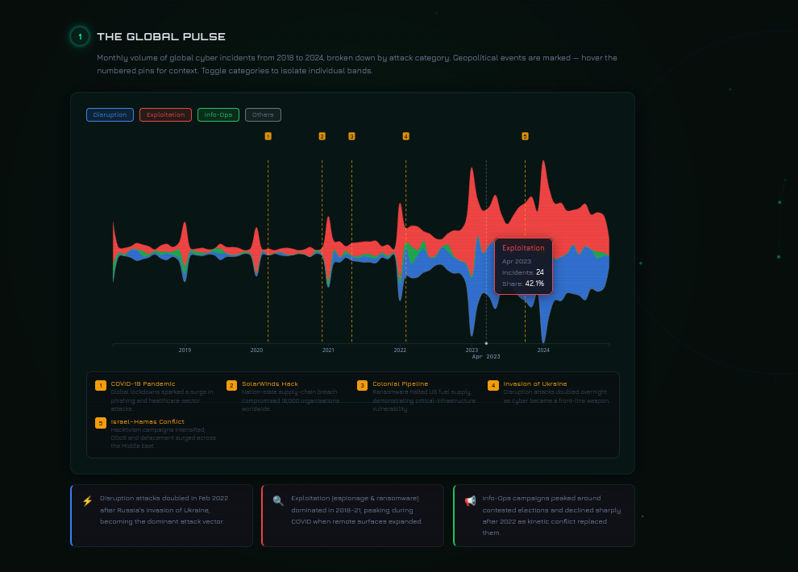
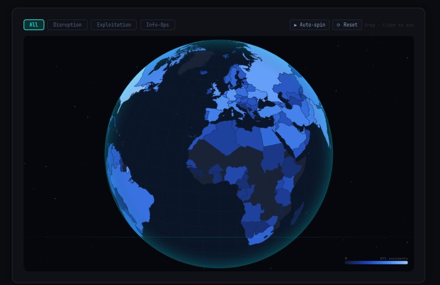
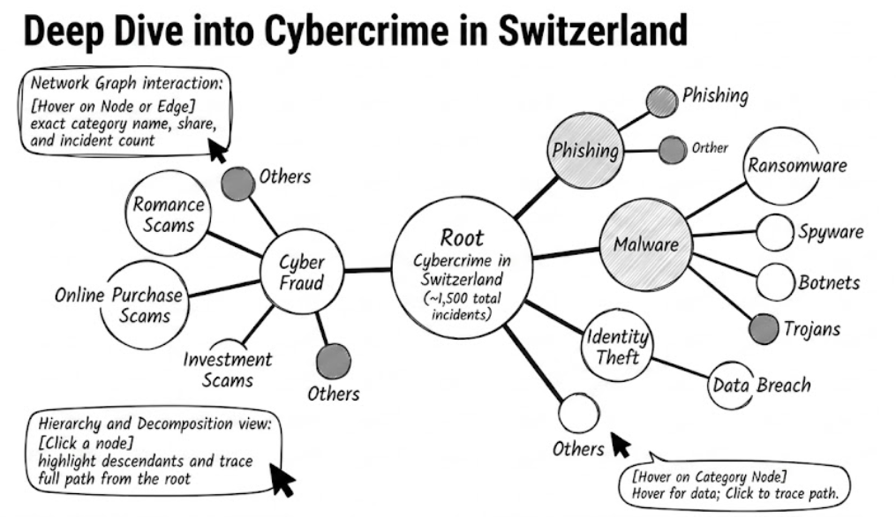
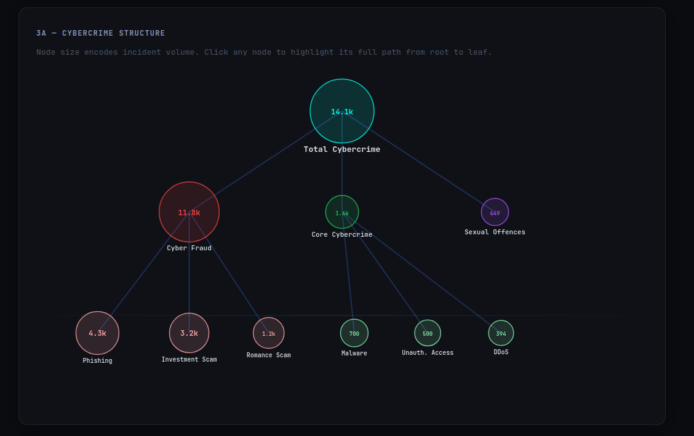
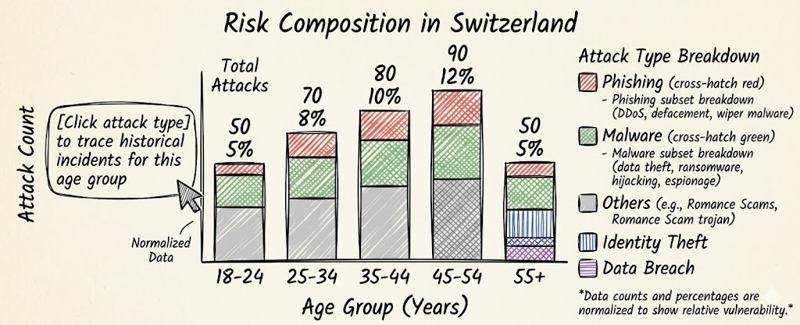
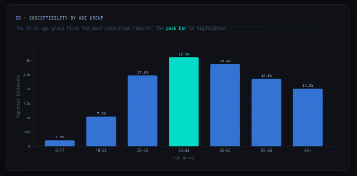

# 1. The Idea

There is an ever-going arms race between countries, companies, and individuals over data, be it bank records, military positions, or political influence. Cybersecurity incidents are documented and publicly available, yet their sheer volume and technical nature make them inaccessible to most people. An analyst can read individual incident reports, but understanding the macro-level shape of global cyber conflict requires synthesizing thousands of records at once.

Our goal was to build a data story that makes two decades of global cyber conflict readable to anyone: analysts catching up on trends, students learning about geopolitics, or simply curious citizens wondering whether Switzerland is as exposed as other nations.

We structured the narrative in three acts, moving from the global to the local:

1. **The Global Pulse**, monthly attack volumes by category from 2018 to 2024, anchored to real geopolitical events
2. **Attack Intensity by Country**, which nations are most targeted and who is behind the attacks
3. **Switzerland: A Domestic Deep Dive**, national FSO Police Crime Statistics revealing the structure of local cybercrime and the age groups most at risk

**Datasets:**

- **EuRepoC Global Cyber Incidents v1.3** - 3,414 incidents from 2000 to 2024, with 60+ variables including attack type, actor, target country, intensity score, and attribution method. Maintained by a consortium of European universities tracking state-sponsored and politically motivated cyber operations globally. The main data quality issue is `economic_impact`, missing in approximately 48% of rows, reflecting how rarely financial damage figures are publicly disclosed.

- **Digital crime: Offences by modus operandi** - around 190,000 cybercrime records from 2020 to 2024, covering the entirety of cyber attacks across Switzerland. Published under an open data licence via opendata.swiss, the dataset spans all Swiss cantons and serves the same purpose as our former Zurich dataset, but at national scale.

# 2. From Sketches to Reality

## Visualization 1: Streamgraph: The Global Pulse

{ width=47% } { width=50% }

*Left: original sketch. Right: final D3 implementation.*

**What was planned:** A streamgraph showing monthly incident volume stacked by attack category, with vertical dashed markers annotating key geopolitical events and hover tooltips for exact counts.

**What changed and why:** We switched from **Plotly.js to pure D3.js**. Plotly's abstraction layer made it impossible to control the stacking offset algorithm, it defaulted to a hard baseline, producing a shape where relative shifts between categories were not visible. D3's `stackOffsetSilhouette` gives the organic, centred form that makes composition shifts immediately readable.

Event labels moved from inline text (which overlapped on a narrow axis) to **numbered amber pins** with a legend grid below, each number links to a short event description and its cyber impact. A **category toggle** was added after user testing: hiding Exploitation made the Disruption surge around the Ukraine invasion far more apparent. A **vertical crosshair line** tracks the mouse across the chart, showing the exact date on the x-axis as the user hovers, making it easy to correlate spikes with the geopolitical event pins.

**Key insight:** The Disruption band visibly doubles in February 2022, the exact month of Russia's invasion of Ukraine, making the geopolitical correlation readable without any annotation.

## Visualization 2: Globe: Attack Intensity by Country

{ width=47% } { width=47% }

*Left: original flat choropleth sketch. Right: final 3D rotatable globe.*

**What was planned:** A flat choropleth world map coloured by share of global attacks, with a dropdown filter by attack type and a click-to-pin detail panel.

**What changed and why:** The flat Mercator map was replaced with a **3D rotatable globe**. The Mercator projection distorts area heavily, Ukraine appears tiny relative to Canada. The orthographic globe shows true relative sizes and the drag-to-rotate interaction invites exploration. The dropdown became **toggle buttons** (All / Disruption / Exploitation); the click panel was upgraded to show the **top attributed threat actors** per country. A **logarithmic colour scale** was necessary because the distribution is heavily right-skewed: the US has 871 total incidents while the median country has fewer than 5.

**Key insight:** Switching to Exploitation reveals China as the primary attributed actor. Switching to Disruption highlights Ukraine and European nations as the primary targets of Russian state operations.

## Visualization 3a: Network Graph: Swiss Cybercrime Structure

{ width=47% } { width=50% }

*Left: original force-directed sketch. Right: final radial circle layout.*

**What was planned:** A node-link graph branching from a root node (total Swiss cybercrime) into main categories and subcategories, with node size proportional to incident count.

**What changed and why:** Force-directed layouts are non-deterministic, for a strict 10-node hierarchy, the depth relationship is the entire point. We iterated through a **fixed depth-based layout** (stable but rigid), then a **radial circle layout**: root at centre, categories at R1, eleven subcategory leaves equally distributed at R2 using arc spacing `angle = (2*pi*(i+0.5))/nLeaves`. Edges connect circle boundaries rather than centres. A **click-to-highlight path** feature fades all nodes outside the selected root-to-leaf path.

**Key insight:** Property crime dominates at 78% of all Swiss digital offences (2020–2024), with Cyber Fraud alone accounting for 132k out of 190k total incidents. Core cybercrime (Phishing, Hacking, Malware, DDoS) represents 11%.

## Visualization 3b: Bar Chart: Age Susceptibility

{ width=47% } { width=50% }

*Left: original sketch. Right: final implementation with animated bars and peak highlight.*

**What was planned:** A bar chart showing how different age ranges are affected by cybercrime in Switzerland.

**What changed and why:** Implementation stayed close to the sketch. The key decision was **highlighting the peak bar** (35–49) in mint while keeping all others in blue, the answer to "who is most at risk?" is visible in under a second. Percentage labels sit on top of each bar and bars animate upward on page load.

**Key insight:** The 35–49 cohort accounts for 28.6% of all tracked victims (2020–2024). Minors under 18 are underrepresented at 3.6%, while the 70+ group represents 9.4%, disproportionately affected by tech support scams and romance fraud.

# 3. Technical Implementation

**Stack:** React 18 + Vite 5 (SPA), D3.js v7, TopoJSON, HTML Canvas 2D API (globe renderer and animated background), Google Fonts (Orbitron / Jura / JetBrains Mono), GitHub Actions + GitHub Pages.

All four visualizations are independent React components managing their own D3 instance via `useRef` and `useEffect`. Data is loaded once in `App.jsx` and passed as props. Tooltips use `createPortal(tooltip, document.body)` with `position: fixed` and `event.clientX / clientY`, immune to parent container offsets and `overflow: hidden` clipping. The globe renders on a `<canvas>` element; the animated node network background runs on a second full-screen canvas underneath React's `#root`.

**Selected technical challenges:**

**Timezone bug (flat streamgraph).** The EuRepoC dataset stores timestamps as ISO strings ("2022-02-01T00:00:00.000000"). Our initial implementation parsed these with `new Date(iso).toISOString()` to use as map keys. In a UTC+2 timezone, midnight on February 1st becomes 10pm on January 31st after UTC conversion, shifting every date back by one day and causing all data lookups to return zero. The result was a completely flat chart with no visible data. Fix: use raw ISO strings directly as map keys (no parsing). Parse dates for D3's time scale as `new Date(s.slice(0, 10) + 'T12:00:00Z')`, noon UTC, immune to local timezone offset shifts.

**Globe SVG to Canvas rewrite (10fps to 60fps).** The original globe used D3/SVG. During drag, React re-renders triggered by rotation state updates forced a full virtual DOM diff and SVG repaint each frame. On large world topologies (240 country paths), this consistently dropped to 10fps, making the interaction feel unresponsive. We rewrote the globe entirely as a Canvas 2D renderer using `d3.geoPath(projection, ctx)`. Key optimisations: `scheduleFrame()` coalesces rapid calls via a single `requestAnimationFrame` handle, preventing double-renders; an `isDragging` flag skips the expensive `countryAtPoint()` hit-test during drag; `projectionRef` is mutated in-place each frame rather than replaced; `colorCacheRef` is a pre-built country-name to hex lookup rebuilt only when the attack type changes; an off-screen scratch canvas handles `isPointInPath()` click hit-testing without affecting the visible render.

**Tooltip architecture.** All four charts initially rendered tooltips as absolutely-positioned divs inside their own containers. When charts were placed in `overflow: hidden` cards, tooltips were clipped at the card boundary. The unified fix: `createPortal(tooltip, document.body)` with `position: fixed` and `event.clientX / clientY` coordinates, was applied to all four charts and the globe's drag handler.

**Stale closures in D3 timer.** The `d3.timer` callback captured `selectedType` from the first render via JavaScript closure. When the user changed the attack-type filter, the globe continued rendering with the old colour scheme because the closure saw the original value. Fix: maintain `useRef` mirrors of all state variables; the timer reads refs (always current) rather than the stale closed-over state.

**Kosovo ghost polygons.** After rotating the globe, dozens of dark triangles appeared scattered across Russia's territory, each identifying as "Kosovo" on hover. Kosovo's TopoJSON feature has `id: undefined`. With `undefined` as the D3 data join key, D3 cannot match existing DOM elements on re-renders and appends a new path every animation frame. After a few seconds of auto-spin, hundreds of orphaned paths had accumulated. Fix: filter features before the data join with `countries.features.filter(d => d.id !== undefined)`.

**Hover highlight persisting after globe rotation.** Hovering a country then rotating the globe left the highlight stroke permanently on that country, since `mouseout` never fires when the globe rotates away. Fix: track the hovered country in a `hoveredCountryRef`; every `drawPaths()` frame re-applies stroke based on the ref, so a stale highlight cannot survive a rotation.

**Vite build overwriting source `index.html`.** Running `vite build` with `outDir: './'` wrote the compiled bundle index.html over the source file, replacing the dev script tag with hashed bundle references. Fix: `outDir: 'dist'`; the GitHub Actions workflow uploads `docs/dist` instead of `docs`.

**CSS `#root` blocking canvas.** After implementing the animated canvas background, the page appeared identical to the plain dark background. The canvas was rendering correctly, but `#root` had `background: var(--bg)`, a solid opaque dark colour, set in `index.css`, covering the canvas entirely. Fix: `#root { background: transparent }`.

# 4. Design Decisions

**Visual identity.** Background `#060e0c` (dark teal-black), accent `#00ffb4` (mint teal), Orbitron for headings, Jura for body text, JetBrains Mono for data labels and axis ticks. The palette is inspired by professional cybersecurity dashboards, deep teal reads as "active terminal" rather than generic dark mode, and the mint accent is warmer than pure cyan, reducing eye fatigue during extended reading while remaining strongly associated with security UIs. Every section uses a numbered badge with a pulse animation, reinforcing the "active monitoring" metaphor throughout the narrative.

The animated **node network background** is drawn on a full-screen HTML canvas with three depth layers: far nodes are small, slow, and dim; near nodes are large, fast, and fully bright with a specular highlight. Pulse waves propagate from randomly triggered source nodes and are rendered as expanding concentric rings that fade as they travel outward. Near-layer nodes repel away from the mouse cursor as it moves across the screen, and clicking anywhere spawns a new pulse ring at that point. This gives the page a sense of live network traffic without distracting from the data visualizations layered above.

**Consistent colour system across all charts.** Blue (`#3b82f6`) = Disruption (streamgraph bands), Red (`#ef4444`) = Exploitation, Green (`#22c55e`) = Info-Ops, Mint (`#00ffb4`) = UI accent and peak highlights, Amber (`#f59e0b`) = geopolitical event pins and globe toggle button accents. This colour system is consistent across the streamgraph bands, the globe filter buttons, and the insight cards below each section, so users build a mental model from the streamgraph that transfers directly to the globe.

**Chart type rationale.** Streamgraph over line chart: simultaneously encodes total volume and composition shift in a single view; the Disruption surge in February 2022 is visible without annotation, which a multi-line chart would require mental arithmetic to reconstruct from individual series. Globe over flat map: eliminates Mercator area distortion and the drag interaction naturally invites exploration. Radial layout over force-directed: hierarchy is stable and legible in one glance for a 10-node tree. Logarithmic colour scale on the globe: a linear scale would compress all but three or four countries into an indistinguishable near-zero shade given the heavily right-skewed attack distribution.

**Scroll-reveal and entrance animations.** Sections fade up as they enter the viewport, giving the page a sense of progression as the user moves through the three-act narrative. Stat counters in the hero animate from zero on first scroll, giving the headline numbers a sense of scale and motion. The animated background persists across all sections, tying the visual identity together from top to bottom.

# 5. Challenges and Iterations

**Plotly to D3 migration.** We originally planned to use Plotly.js for the streamgraph and bar chart (documented in Milestone 2). During implementation it became clear that Plotly's abstractions prevented the interactions and visual style we needed, there was no way to control the stacking offset algorithm, the tooltip design, or the animation timing. The migration to pure D3 added approximately two weeks of development time but gave complete control over every visual element.

**Flat map to globe rewrite.** The flat choropleth was implemented, tested, and discarded. The Mercator distortion was not just an aesthetic issue, it was informationally wrong, misrepresenting the relative exposure of countries that are central to the dataset. Rewriting as a globe required learning D3's orthographic projection, implementing drag-based rotation with pitch clamping to prevent the globe from flipping upside down, and separating static from dynamic render layers for smooth 60fps animation. This was the largest single refactor of the project.

**Network graph layout iterations.** The network graph went through three layout strategies before the final radial design. Force-directed was the first attempt (non-deterministic, hierarchy lost). A fixed horizontal depth layout was the second (stable but rigid, with large wasted whitespace). The final radial circle layout places the root at centre and distributes leaves with equal angular spacing, the circular form reinforces the "everything connects to the centre" message of the dataset.

**Animation debugging.** After adding all entrance animations at once, the site went blank. We reverted every animation and re-added them individually to isolate the cause. The root cause was the `IntersectionObserver` scroll-reveal: sections started at `opacity: 0` and the observer was configured with `threshold: 0.12`, meaning a section had to be 12% visible before revealing. During initial load, the page was not tall enough because the charts had not yet rendered, so the observer never fired for any section. Fix: threshold 0, sections reveal as soon as any pixel enters the viewport.

**React StrictMode.** In development, React StrictMode double-invokes all `useEffect` calls to detect side effects. This caused `initSvg()` to run twice: the second invocation cleared the SVG and ran a new initialisation cycle immediately after the first `drawPaths()` had populated it, resulting in a blank globe and broken event handlers. We removed StrictMode and added an explicit error boundary that renders stack traces during development instead.

**Data preprocessing.** The EuRepoC dataset in raw form is several megabytes of JSON with 60+ columns per incident, most of which are irrelevant to our visualisations. We preprocessed it into two lean files: `graph1.json` (monthly aggregates by attack type for the streamgraph) and `country-intensity-by-type.json` (per-country totals per attack type for the globe). This reduced the total data transferred on page load from ~8MB to under 200KB.

# 6. Peer Assessment

All three team members contributed equally (approximately one third each). Work was divided by visualization ownership, with shared responsibility for data processing, narrative design, and integration testing. Decisions on visual design, interaction model, and data story structure were made collectively through iterative review sessions. The peer assessment below reflects primary ownership; in practice, every component received input from all three members.

The project spanned three milestones over the course of the semester. Milestone 1 established the dataset selection, exploratory analysis, and initial sketches. Milestone 2 refined the interaction design and produced first working prototypes. Milestone 3 involved the full implementation, performance optimisation, visual identity, and the process book. The total volume of code written, across React components, D3 chart implementations, data preprocessing scripts, and the CI pipeline, amounts to approximately 2,100 lines across 8 React/JS source files.

\begin{tabular}{p{3cm} p{11.2cm}}
\toprule
\textbf{Team Member} & \textbf{Contributions} \\
\midrule
Erik Hubner & Website architecture (React + Vite), Streamgraph (D3, event markers, toggles), deployment pipeline (GitHub Actions / Pages), animations, visual identity, process book \\
\addlinespace
Youcef Amar & Globe (orthographic projection, drag rotation, log colour scale, attribution panel), EuRepoC data processing, attack-type filtering, country-sources data \\
\addlinespace
Andre Cadet & Network graph (radial layout, click-to-highlight), age bar chart, Swiss digital crime data processing, narrative copy, insight cards, data analysis \\
\bottomrule
\end{tabular}

\vspace{0.6cm}

**Datasets:** EuRepoC Cyber Incident Dataset v1.3, https://eurepoc.eu $\cdot$ Digital crime: Offences by modus operandi, https://opendata.swiss/de/dataset/digitale-kriminalitat-straftaten-nach-modusgruppe/resource/95b86043-256d-4fad-a42b-7e3d36d75f70

**Technologies:** D3.js v7 $\cdot$ React 18 $\cdot$ Vite 5 $\cdot$ TopoJSON $\cdot$ Google Fonts $\cdot$ GitHub Actions $\cdot$ GitHub Pages
